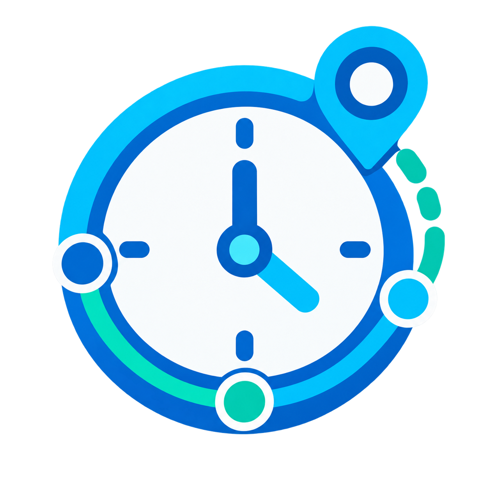

# Activity Tracker

  

Track how long an entity, person, zone, area-presence sensor, or foreground application is active in Home Assistant.

Activity Tracker observes state changes live and stores compact daily summaries, so reports continue to work beyond Recorder retention. Each configured monitor is a separate Home Assistant device with only the entities selected during setup.

## Features

- Entity/generic active-state, zone, area-presence, and foreground-application monitors.
- Daily, current-week, current-month, and custom rolling calendar-day durations.
- Session counts, duration statistics, current activity, and latest completed-session details.
- Session splitting at local midnight, configurable minimum session duration, per-monitor retention, and foreground-app aggregation.
- UI-only setup and options; no YAML configuration.

## HACS availability

Activity Tracker is available as a **HACS custom repository** (category: **Integration**). It is not currently in the default HACS catalog: `https://github.com/alves-dev/ha-activity-tracker`.

## Installation

In HACS, add this repository as a **Custom repository** with category **Integration**, then install it and restart Home Assistant. Alternatively, copy `custom_components/activity_tracker` into your Home Assistant configuration directory and restart.

## Configuration and operation

Add **Activity Tracker** from *Settings → Devices & services → Add integration*. The guided flow selects the monitor source, behavior, report periods, and exactly which metric entities to create. At least one metric and one period are required.

### Choosing the right activity rule

| Activity rule | Use it when | What counts as activity |
| --- | --- | --- |
| Entity active states | An entity already exposes meaningful states. | Its state matches one of the comma-separated values you provide. |
| Person or device in a zone | A `person` or `device_tracker` reports the desired zone name. | Its state exactly matches the selected zone. |
| Person in an internal area | A binary sensor knows whether one person is in an area. | The chosen presence binary sensor is `on`; the person and area are identifying context. |
| Foreground application | An entity reports the app currently in use. | A non-empty state or attribute value is present; changing app starts a new session. |
| Generic state rule | You want an intentionally neutral state-based monitor. | Its state matches one of the values you provide. |

### Session behavior in plain language

- **Retention** is how many local calendar days of compact summaries remain available. It is not a copy of Recorder history.
- **Minimum session duration** filters out completed sessions shorter than the chosen number of seconds. Set it to `0` to retain every completed session.
- **Unavailable tolerance** applies when Home Assistant cannot read the source. It is different from a **merge gap**, which applies when the source explicitly reports an inactive state for a short interval (for example, noisy GPS).
- **Rolling days** are calendar dates: “35 days” includes today and the 34 preceding local dates, rather than exactly 840 hours.

While a monitor is active, its current-session entity updates every minute without rewriting storage. Completed valid sessions are consolidated into local-calendar daily summaries. A session that crosses midnight contributes duration to both days, but counts only on its start date.

Foreground-application monitors treat an application switch as the end of one session and beginning of another. Application identifiers remain stable even when labels change.

## Technical documentation

- [Compatibility](docs/compatibility.md)
- [Development and validation](docs/development.md)
- [Storage and entity behavior](docs/architecture.md)

## License

MIT. See [LICENSE](LICENSE).
